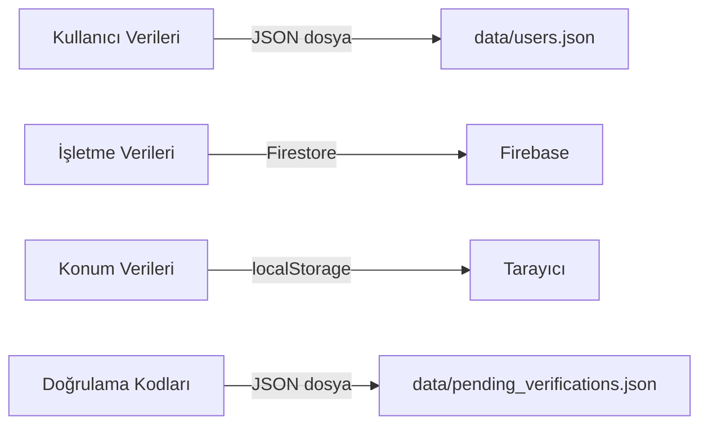

# 🔍 Ciryt Projesi - Kapsamlı Analiz Raporu

> **Tarih:** 23 Şubat 2026  
> **Proje:** Ciryt (BerberRandevu) — Güzellik ve Randevu Platformu  
> **Repo:** [github.com/eray-cirit/BerberRandevu](https://github.com/eray-cirit/BerberRandevu)  
> **Branch:** `main` (clean, up to date)  
> **Toplam commit:** 20  

---

## 📊 Proje Özeti

Ciryt, Türkiye'deki berber, kuaför ve güzellik salonlarını bulmak ve randevu almak için tasarlanmış bir web platformu. Cinsiyet bazlı UI teması (erkek/kadın), konum bazlı işletme keşfi ve Google OAuth + credentials tabanlı kimlik doğrulama sunuyor.

### Dosya İstatistikleri

| Kategori | Sayı |
|---|---|
| Toplam kaynak dosya | 58 |
| Sayfa (page.js) | 11 |
| API Route | 10 |
| Component | 11 |
| CSS Module | 12 |
| Context | 2 |
| Lib | 2 |
| Data dosyası (JSON) | 4 |
| Public asset | 7 (~102 MB) |

---

## 🛠️ Teknoloji Stack'i ve Durum Değerlendirmesi

### Temel Bağımlılıklar

| Paket | Versiyon | Güncel Durum | Değerlendirme |
|---|---|---|---|
| `next` | 14.2.35 | ⚠️ **Eski** — Next.js 15 çıktı | Upgrade önerilir |
| `react` / `react-dom` | ^18 | ⚠️ React 19 çıktı | Next.js 15 ile birlikte upgrade |
| `next-auth` | ^4.24.5 | ⚠️ **Eski** — Auth.js v5 çıktı | v5'e migration önerilir |
| `firebase` | ^10.7.1 | ✅ Kabul edilebilir | 11.x mevcut |
| `framer-motion` | ^12.23.26 | ✅ Güncel | — |
| `bcryptjs` | ^2.4.3 | ✅ Stabil | — |
| `leaflet` / `react-leaflet` | ^1.9.4 / ^4.2.1 | ✅ Güncel | — |
| `tailwindcss` | ^3.4.1 | ⚠️ **Eski** — TailwindCSS 4 çıktı | Tailwind 4'e migration |

### ❌ Gereksiz / Kullanılmayan Bağımlılıklar

| Paket | Durum | Neden Gereksiz |
|---|---|---|
| `@react-three/fiber` (^8.16.8) | 🔴 **Hiç kullanılmıyor** | Hiçbir dosyada import yok |
| `three` (^0.162.0) | 🔴 **Hiç kullanılmıyor** | Hiçbir dosyada import yok |
| `@lottiefiles/react-lottie-player` (^3.6.0) | 🔴 **Hiç kullanılmıyor** | Hiçbir dosyada import yok |

> [!CAUTION]
> Bu 3 paket toplam **~5-10 MB** bundle boyutu ekliyor ama hiçbir yerde kullanılmıyor. Hemen kaldırılmalı.

---

## 🚨 KRİTİK GÜVENLİK AÇIKLARI

### 1. Plain Text Şifre Kaydediliyor

```javascript
// src/app/api/auth/register/route.js — Satır 116
const newUser = {
    // ...
    password: hashedPassword,
    plainPassword: pending.password, // ⚠️ Admin için plain text şifre
    // ...
};
```

> [!CAUTION]
> `plainPassword` alanı kullanıcının şifresini **açık metin olarak** JSON dosyasına kaydediyor. Bu **ciddi bir güvenlik ihlali** (CWE-256). Hash'li şifre zaten var, bu alan **hemen kaldırılmalı**.

### 2. Doğrulama Kodu Development'ta Response'da Dönüyor

```javascript
// src/app/api/auth/register/route.js — Satır 53
code: process.env.NODE_ENV === "development" ? verificationCode : undefined,
```

Bu development için kabul edilebilir ama production'a çıkmadan önce dikkatli olunmalı.

### 3. API Route Koruması Yok

- `/api/admin/users` — Admin kontrolü yok, herkes erişebilir
- `/api/auth/check-gender` — Rate limiting yok
- `/api/businesses` — Authentication kontrolü yok

### 4. JSON Dosyası ile Veritabanı

[db.js](file:///home/insane/Desktop/Ciryt/BerberRandevu/src/lib/db.js) dosya sistemi üzerinde JSON dosyalarıyla çalışıyor:

- `data/users.json` — Kullanıcı verileri (şifreler dahil!)
- `data/pending_verifications.json` — Bekleyen doğrulamalar

> [!WARNING]
> JSON dosya tabanlı "veritabanı" **race condition**, **veri kaybı**, **ölçeklenme sorunu** ve **güvenlik riski** taşıyor. Vercel'e deploy edildiğinde dosya sistemi ephemeral'dır — yani her deploy'da veriler **sıfırlanır**.

---

## 🏗️ MİMARİ SORUNLAR

### 1. Çift Veritabanı Mimarisi (Hibrit Karmaşa)



- **Kullanıcılar** → JSON dosya (`db.js`)
- **İşletmeler** → Firebase Firestore (`firebase.js`)
- **Konum tercihi** → localStorage
- Bu tutarsızlık karmaşa yaratıyor. **Tüm veriler tek kaynakta (Firestore) olmalı.**

### 2. Hardcoded Demo Veriler

[page.js](file:///home/insane/Desktop/Ciryt/BerberRandevu/src/app/page.js) içinde **150+ satır hardcoded demo veri** var (satır 57-148):

- `maleCategories` — 15 sahte berber/salon
- `femaleCategories` — 25 sahte kuaför/salon
- Tüm görseller Unsplash URL'leri
- Rating, yorum sayısı, mesafe hep sahte

> Bu veriler API'den çekilmeli veya en azından ayrı bir dosyaya taşınmalı.

### 3. GenderProvider Layout'ta Yok

```javascript
// src/app/layout.js — AuthProvider ve LocationProvider var ama GenderProvider yok
<AuthProvider>
  <LocationProvider>
    <Navbar />
    <main>{children}</main>
    <Footer />
  </LocationProvider>
</AuthProvider>
```

`GenderProvider` layout'a eklenmemiş. `useGender()` hook'u context dışında çağrıldığında sessizce varsayılan değer dönüyor (hata fırlatmak yerine).

### 4. Dashboard Sadece "Başarılı Giriş" Kartı

[dashboard/page.js](file:///home/insane/Desktop/Ciryt/BerberRandevu/src/app/dashboard/page.js) yalnızca bir "Giriş Başarılı!" kartı gösteriyor. Gerçek bir dashboard değil.

### 5. Yakında Sayfası = Placeholder

[yakinda/page.js](file:///home/insane/Desktop/Ciryt/BerberRandevu/src/app/yakinda/page.js) sadece "Yakında sizlerle!" diyen bir sayfa. Navbar'da "Hakkımızda" linki buraya yönleniyor — kafa karıştırıcı.

---

## 📁 GEREKSIZ DOSYALAR

| Dosya/Klasör | Boyut | Neden Gereksiz |
|---|---|---|
| `public/transition.mov` | **85.7 MB** | `.mp4` versiyonu zaten var (4.9 MB). `.mov` silinmeli |
| `public/transition-reverse.mp4` | 52 B | Bozuk dosya (52 byte = boş) |
| `public/venom-bg-female.png` | 610 KB | Kullanılıyor mu kontrol edilmeli |
| `src/components/animations/InkSplash.js` | 5 KB | **Hiçbir yerde import edilmiyor** |
| `src/app/fonts/GeistMonoVF.woff` | — | Kullanılmıyor (Montserrat ve Dancing Script kullanılıyor) |
| `src/app/fonts/GeistVF.woff` | — | Kullanılmıyor |
| `data/businesses.json` | 9.9 KB | İşletmeler Firestore'dan geliyor, bu dosya eski kalıntı |
| `.eslintrc.json` | 40 B | Neredeyse boş (`{ "extends": "next/core-web-vitals" }`) — flat config'e geçilmeli |

> [!IMPORTANT]
> Sadece `public/transition.mov` dosyasını silmek **85 MB** tasarruf sağlar.

---

## ⚠️ KOD KALİTESİ SORUNLARI

### 1. `"use client"` Her Yerde

Neredeyse tüm sayfalar `"use client"` direktifi kullanıyor. Bu, Next.js App Router'ın **Server Components** avantajından yararlanılmadığı anlamına geliyor:

| Dosya | SSR mümkün mü? |
|---|---|
| `page.js` (ana sayfa) | ❌ Client (session + gender state) |
| `kesfet/page.js` | ❌ Client (fetch + state) |
| `dashboard/page.js` | ❌ Client (session) |
| `hesabim/page.js` | ❌ Client (session) |
| `yakinda/page.js` | ❌ Client (gereksiz — statik olabilir) |
| `admin/page.js` | ❌ Client |

> `yakinda/page.js` gibi statik sayfalar **Server Component** olabilir.

### 2. Tutarsız Gender Yönetimi

- `GenderContext.js` → `"erkek"` / `"kadın"` (Türkçe)
- API'ler ve session → `"male"` / `"female"` (İngilizce)
- Sürekli `erkek ↔ male` dönüşümleri yapılıyor
- Bu **bug kaynağı** ve karmaşık

### 3. CSS Yaklaşımı Karmaşık

- `globals.css` → Tailwind directives + custom CSS variables + utility classes
- Sayfalar → CSS Modules kullanıyor
- Bazı yerlerde inline styles var
- 3 farklı styling yaklaşımı bir arada

### 4. Error Handling Zayıf

- API route'larda genel `try-catch` var ama spesifik hata yönetimi yok
- Client-side'da `console.error` kullanılıyor, kullanıcıya hata gösterilmiyor
- Validation yetersiz

---

## 📐 SAYFA YAPISI HALİHAZIRDA

```mermaid
graph TD
    A[/ Ana Sayfa] --> B[/giris/erkek]
    A --> C[/giris/kadin]
    A --> D[/kayit/erkek]
    A --> E[/kayit/kadin]
    A --> F[/kesfet — İşletme Keşfet]
    A --> G[/dashboard — Giriş Başarılı]
    A --> H[/hesabim — Profil]
    A --> I[/konum-sec — Konum Wizard]
    A --> J[/yakinda — Placeholder]
    A --> K[/admin — Kullanıcı Yönetimi]
    
    F -.->|API| L[/api/businesses]
    B -.->|API| M[/api/auth/nextauth]
    D -.->|API| N[/api/auth/register]
    K -.->|API| O[/api/admin/users]
```

---

## 🎯 ÖNCELİKLENDİRİLMİŞ İYİLEŞTİRME PLANI

### 🔴 Öncelik 1: Kritik (Hemen Yapılmalı)

1. **`plainPassword` alanını kaldır** — Güvenlik açığı
2. **Kullanılmayan paketleri kaldır** — `three`, `@react-three/fiber`, `@lottiefiles/react-lottie-player`
3. **`transition.mov` dosyasını sil** — 85 MB gereksiz
4. **`InkSplash.js` component'ini kaldır** — Kullanılmıyor
5. **Bozuk `transition-reverse.mp4` dosyasını sil** — 52 byte
6. **`GenderProvider`'ı layout'a ekle** — Context çalışmıyor

### 🟡 Öncelik 2: Önemli (Yakın Zamanda)

7. **JSON dosya DB'yi Firestore'a taşı** — `users.json` ve `pending_verifications.json`
8. **API route'lara auth middleware ekle** — Özellikle admin route'lar
9. **Hardcoded demo verileri ayır** — `page.js`'den çıkar
10. **Gender string'lerini standartlaşır** — Tek format (`male`/`female`)
11. **Kullanılmayan font dosyalarını sil** — Geist fontları
12. **Dashboard'u gerçek bir dashboard yap**

### 🟢 Öncelik 3: İyileştirme (Zamanla)

13. **Next.js 15 + React 19'a upgrade**
14. **NextAuth v4 → Auth.js v5 migration**
15. **Tailwind CSS 4'e upgrade**
16. **Server Components'i doğru kullan** — `yakinda`, statik kısımlar
17. **CSS yaklaşımını standartlaştır**
18. **Hata yönetimini iyileştir**
19. **Rate limiting ve CORS ekle**
20. **`README.md`'yi proje için güncelle** — Şu an default Next.js README

---

## 📦 Paket Boyut Etkisi

```
Kaldırılacak paketler:
├── three ...................... ~1.5 MB (minified)
├── @react-three/fiber ......... ~500 KB
├── @lottiefiles/react-lottie .. ~200 KB
└── TOPLAM TASARRUF ............ ~2.2 MB bundle
    + 85 MB (.mov dosyası)
    = ~87 MB toplam tasarruf
```

---

## 🏁 Sonuç

Proje işlevsel bir prototip aşamasında. Temel özellikler (auth, işletme keşfi, konum seçimi) çalışıyor ama:

- **Güvenlik** ciddi sorunlar var (plainPassword, korumasız API'ler)
- **Mimari** tutarsız (çift DB, gender string karmaşası)
- **Performans** gereksiz paketler ve dosyalar var (~87 MB fazlalık)
- **Kod kalitesi** iyileştirmeye açık (SSR, error handling)

İyileştirmeleri **öncelik sırasına göre** adım adım yapacağız.
