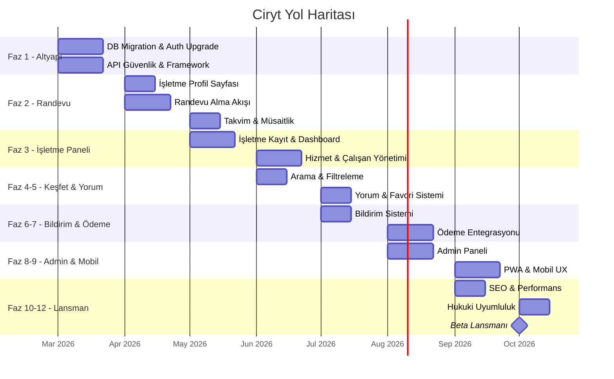

# 🗺️ Ciryt — Kapsamlı Yapılacaklar ve Yol Haritası

> **Vizyon:** Türkiye'nin 1 numaralı güzellik ve randevu platformu  
> **Hedef Kitle:** 81 il, 50.000+ güzellik salonu, milyonlarca kullanıcı  
> **Son Güncelleme:** 23 Şubat 2026

---

## 📍 Şu Anki Durum

```
✅ Landing page (cinsiyet bazlı tema)
✅ Kullanıcı kayıt/giriş (Email + Google OAuth)
✅ Keşfet sayfası (harita + grid görünümü)
✅ Konum seçimi (İl > İlçe > Mahalle wizard)
✅ Hesabım sayfası (temel profil)
✅ Firebase Firestore (işletme verileri)
✅ Cinsiyet bazlı UI (erkek/kadın tema)
❌ Randevu sistemi yok
❌ İşletme paneli yok
❌ Ödeme sistemi yok
❌ Gerçek arama/filtreleme yok
❌ Yorum/değerlendirme sistemi yok
❌ Admin paneli temel seviyede
❌ Bildirim sistemi yok
❌ Mobil uygulama yok
```

---

## Faz 1 — Altyapı ve Mimari Düzeltme
> **Süre:** 2-3 hafta | **Öncelik:** 🔴 Kritik

### 1.1 Veritabanı Mimarisi

- [ ] JSON dosya DB'yi tamamen kaldır (`lib/db.js`)
- [ ] Tüm kullanıcı verilerini Firebase Firestore'a taşı
- [ ] Firestore koleksiyonlarını tasarla:
  - `users` — Kullanıcı profilleri
  - `businesses` — İşletmeler (mevcut)
  - `appointments` — Randevular
  - `reviews` — Yorumlar
  - `services` — Hizmet tanımları
  - `notifications` — Bildirimler
  - `payments` — Ödeme kayıtları
- [ ] Firestore güvenlik kurallarını yaz (Security Rules)
- [ ] Firestore indekslerini oluştur (composite indexes)

### 1.2 Kimlik Doğrulama Upgrade

- [ ] NextAuth v4 → Auth.js v5 migration
- [ ] Firebase Auth entegrasyonu (Firestore ile uyumlu)
- [ ] Telefon numarası ile giriş (SMS OTP — Türkiye için kritik)
- [ ] Apple Sign-In desteği
- [ ] Şifre sıfırlama akışı
- [ ] Email doğrulama akışı (gerçek email gönderimi)
- [ ] Session yönetimi ve token refresh

### 1.3 API Güvenliği

- [ ] Tüm API route'lara auth middleware ekle
- [ ] Admin route'lara role-based access control (RBAC)
- [ ] Rate limiting (brute force koruması)
- [ ] CORS konfigürasyonu
- [ ] Input validation (Zod schema ile)
- [ ] API response standardizasyonu (error codes, pagination)

### 1.4 Framework ve Paket Güncellemeleri

- [ ] Next.js 14 → 15 upgrade
- [ ] React 18 → 19 upgrade
- [ ] Tailwind CSS 3 → 4 upgrade
- [ ] ESLint 8 → 9 (flat config)
- [ ] TypeScript'e geçiş (JS → TS migration)

### 1.5 Kod Kalitesi

- [ ] Gender string'lerini standartlaştır (`male`/`female` — tek format)
- [ ] CSS yaklaşımını standartlaştır (Tailwind veya CSS Modules — birini seç)
- [ ] Hardcoded demo verileri kaldır, API'den çek
- [ ] Error boundary component'i ekle
- [ ] Loading skeleton component'leri
- [ ] `README.md`'yi proje için yeniden yaz
- [ ] `.env.example` dosyası oluştur

---

## Faz 2 — Randevu Sistemi (Çekirdek Özellik)
> **Süre:** 4-6 hafta | **Öncelik:** 🔴 Kritik

### 2.1 İşletme Profil Sayfası

- [ ] `/isletme/[slug]` — Dinamik işletme detay sayfası
- [ ] İşletme bilgileri (ad, adres, telefon, çalışma saatleri)
- [ ] Fotoğraf galerisi (swiper/carousel)
- [ ] Hizmet listesi ve fiyatları
- [ ] Çalışan kadrosu (berber/kuaför/uzman profilleri)
- [ ] Yorum ve puanlama bölümü
- [ ] Konumu haritada gösterme
- [ ] Sosyal medya linkleri
- [ ] "Randevu Al" CTA butonu

### 2.2 Randevu Alma Akışı

- [ ] Hizmet seçimi (saç kesimi, boyama, manikür vb.)
- [ ] Çalışan seçimi (tercih edilen uzman)
- [ ] Tarih ve saat seçimi (takvim UI)
- [ ] İşletmenin müsaitlik durumu (real-time)
- [ ] Randevu onay ekranı (özet + fiyat)
- [ ] Randevu oluşturma API'si
- [ ] Çoklu hizmet seçimi (kombine randevu)
- [ ] Tahmini süre hesaplama

### 2.3 Randevu Yönetimi (Kullanıcı)

- [ ] Aktif randevular listesi
- [ ] Geçmiş randevular
- [ ] Randevu iptal etme (iptal politikası ile)
- [ ] Randevu erteleme/değiştirme
- [ ] Randevu hatırlatıcı (bildirim)
- [ ] Randevu sonrası yorum bırakma

### 2.4 Takvim ve Müsaitlik Sistemi

- [ ] İşletme çalışma saatleri tanımlama
- [ ] Çalışan bazlı müsaitlik
- [ ] Tatil/mola/özel gün tanımlama
- [ ] Slot bazlı rezervasyon (15/30/60 dk)
- [ ] Çakışma kontrolü (double booking engelleme)
- [ ] Otomatik boş slot hesaplama

---

## Faz 3 — İşletme Paneli (Business Dashboard)
> **Süre:** 4-6 hafta | **Öncelik:** 🔴 Kritik

### 3.1 İşletme Kayıt ve Onay

- [ ] İşletme kayıt formu (detaylı)
- [ ] Vergi numarası / ticaret sicil doğrulaması
- [ ] İşletme belge yükleme (ruhsat, sertifika)
- [ ] Admin onay süreci (onay bekliyor → onaylı → reddedildi)
- [ ] İşletme profil düzenleme

### 3.2 İşletme Dashboard

- [ ] Genel bakış (bugünkü randevular, gelir özeti, yeni yorumlar)
- [ ] Randevu takvimi (günlük/haftalık/aylık görünüm)
- [ ] Gelen randevu talepleri (onayla/reddet)
- [ ] Randevu geçmişi ve istatistikleri
- [ ] Müşteri listesi ve notları

### 3.3 Hizmet ve Fiyat Yönetimi

- [ ] Hizmet ekleme/düzenleme/silme
- [ ] Kategori bazlı hizmetler
- [ ] Fiyat belirleme (TL)
- [ ] Hizmet süresi tanımlama
- [ ] Kampanya/indirim oluşturma
- [ ] Paket hizmet tanımlama (örn: saç kesimi + sakal = %10 indirim)

### 3.4 Çalışan Yönetimi

- [ ] Çalışan ekleme/çıkarma
- [ ] Çalışan profilleri (uzmanlık alanları, deneyim)
- [ ] Çalışan bazlı çalışma saatleri
- [ ] İzin/tatil yönetimi
- [ ] Çalışan performans istatistikleri

### 3.5 Fotoğraf ve Galeri Yönetimi

- [ ] Firebase Storage ile fotoğraf yükleme
- [ ] Fotoğraf sıkıştırma ve optimize etme
- [ ] Galeri düzenleme (sıralama, silme)
- [ ] Kapak fotoğrafı seçme
- [ ] Öncesi-sonrası fotoğraf ekleme

### 3.6 İşletme İstatistikleri

- [ ] Günlük/haftalık/aylık randevu sayısı
- [ ] Gelir raporları (grafik)
- [ ] En popüler hizmetler
- [ ] Müşteri memnuniyeti puanı
- [ ] Doluluk oranı analizi
- [ ] İstatistik PDF olarak dışa aktarma

---

## Faz 4 — Arama, Filtreleme ve Keşfet
> **Süre:** 2-3 hafta | **Öncelik:** 🟡 Önemli

### 4.1 Gelişmiş Arama

- [ ] Tam metin arama (Algolia veya Firestore full-text search)
- [ ] İşletme adı ile arama
- [ ] Hizmet türüne göre arama
- [ ] Konum bazlı arama (yakınımdaki)
- [ ] Arama önerileri (autocomplete)
- [ ] Son aramalar geçmişi

### 4.2 Filtreleme Sistemi

- [ ] Mesafe filtresi (1km, 5km, 10km, 25km)
- [ ] Fiyat aralığı filtresi
- [ ] Puan filtresi (4+, 4.5+ yıldız)
- [ ] Hizmet kategorisi filtresi
- [ ] Çalışma saati filtresi (şu an açık)
- [ ] Cinsiyet filtresi (erkek/kadın/unisex)
- [ ] Sıralama (mesafe, puan, fiyat, popülerlik)

### 4.3 Keşfet Sayfası İyileştirmeleri

- [ ] Harita üzerinde cluster marker'lar
- [ ] Harita üzerinde işletme kartı popup'ları
- [ ] "Bana yakın" GPS butonu
- [ ] Kategori tabanlı keşfet (berber, kuaför, nail art, spa)
- [ ] Öne çıkan işletmeler slider'ı
- [ ] Kampanyalı işletmeler bölümü

### 4.4 Konum Altyapısı

- [ ] 81 ilin tüm ilçe ve mahalleleri (tam veri)
- [ ] Google Geocoding API veya OpenStreetMap Nominatim
- [ ] Konum izni akışı (native prompt + custom fallback)
- [ ] Adres ile konum arama
- [ ] Konum cache'leme

---

## Faz 5 — Yorum, Değerlendirme ve Sosyal
> **Süre:** 2-3 hafta | **Öncelik:** 🟡 Önemli

### 5.1 Yorum Sistemi

- [ ] 1-5 yıldız puanlama
- [ ] Metin yorum yazma
- [ ] Fotoğraflı yorum
- [ ] Yorum yapmak için randevu geçmişi şartı (sahte yorum engelleme)
- [ ] İşletme tarafından yorum yanıtlama
- [ ] Yorum raporlama (spam/uygunsuz)
- [ ] Yorum sıralama (en yeni, en yüksek puan, en faydalı)

### 5.2 Favori Sistemi

- [ ] İşletmeyi favorilere ekleme ❤️
- [ ] Favoriler listesi sayfası
- [ ] Favori işletmeden bildirim alma

### 5.3 Paylaşım

- [ ] İşletme profilini paylaşma (WhatsApp, Instagram, Twitter)
- [ ] Derin linkler (deep links)
- [ ] QR kod ile işletme paylaşımı

---

## Faz 6 — Bildirim Sistemi
> **Süre:** 2 hafta | **Öncelik:** 🟡 Önemli

### 6.1 Uygulama İçi Bildirimler

- [ ] Bildirim merkezi (bell icon + dropdown)
- [ ] Okundu/okunmadı durumu
- [ ] Bildirim tipleri:
  - Randevu onayı
  - Randevu hatırlatıcı (1 saat önce, 1 gün önce)
  - Randevu iptali
  - Yeni yorum bildirimi (işletmeye)
  - Kampanya bildirimi

### 6.2 Push Notifications (Web)

- [ ] Service Worker kurulumu
- [ ] Web Push API entegrasyonu
- [ ] Firebase Cloud Messaging (FCM)
- [ ] Bildirim izni akışı

### 6.3 Email Bildirimleri

- [ ] Email servisi entegrasyonu (Resend, SendGrid veya Mailgun)
- [ ] Randevu onay emaili
- [ ] Randevu hatırlatıcı emaili
- [ ] Hoş geldin emaili
- [ ] Şifre sıfırlama emaili
- [ ] Email template'leri (HTML)

### 6.4 SMS Bildirimleri (Türkiye)

- [ ] SMS provider entegrasyonu (Netgsm, İleti Merkezi, Twilio)
- [ ] Randevu onay SMS'i
- [ ] Randevu hatırlatıcı SMS'i
- [ ] OTP doğrulama SMS'i
- [ ] İYS (İleti Yönetim Sistemi) uyumluluğu

---

## Faz 7 — Ödeme Sistemi
> **Süre:** 3-4 hafta | **Öncelik:** 🟡 Önemli

### 7.1 Ödeme Altyapısı

- [ ] Türkiye ödeme gateway entegrasyonu:
  - **iyzico** (en yaygın) veya
  - **PayTR** veya
  - **Param (eski Paratika)**
- [ ] Kredi kartı ile ödeme
- [ ] Sanal POS entegrasyonu
- [ ] 3D Secure zorunluluğu (BDDK kuralı)
- [ ] Kart kaydetme (tokenization)

### 7.2 Ödeme Akışı

- [ ] Randevu sırasında ön ödeme (kaparo)
- [ ] Tam ödeme (online)
- [ ] İşletmede ödeme (nakit/kart — sadece kayıt)
- [ ] İade/iptal politikası ve otomatik iade
- [ ] Fatura/dekont oluşturma (PDF)

### 7.3 İşletme Cüzdanı

- [ ] İşletme bakiye ekranı
- [ ] Çekim talebi (banka hesabına)
- [ ] Komisyon hesaplama (platform komisyonu)
- [ ] Ödeme geçmişi
- [ ] Otomatik haftalık/aylık ödeme (settlement)

### 7.4 Kampanya ve Kupon Sistemi

- [ ] İndirim kuponu oluşturma
- [ ] Yüzdelik ve sabit tutarlı indirimler
- [ ] İlk randevu indirimi
- [ ] Referans (arkadaşını getir) sistemi
- [ ] Kampanya süresi ve kullanım limiti

---

## Faz 8 — Admin Paneli (Platform Yönetimi)
> **Süre:** 3-4 hafta | **Öncelik:** 🟡 Önemli

### 8.1 Dashboard

- [ ] Platform istatistikleri (toplam kullanıcı, işletme, randevu)
- [ ] Günlük aktif kullanıcı (DAU/MAU)
- [ ] Gelir özeti ve grafikler
- [ ] Yeni kayıtlar (son 24 saat)
- [ ] Bekleyen onaylar

### 8.2 Kullanıcı Yönetimi

- [ ] Kullanıcı listesi (arama, filtreleme, sıralama)
- [ ] Kullanıcı detay sayfası
- [ ] Kullanıcı engelleme/askıya alma
- [ ] Kullanıcı rolü değiştirme
- [ ] Kullanıcı aktivite logları

### 8.3 İşletme Yönetimi

- [ ] İşletme başvuruları (onay kuyruğu)
- [ ] İşletme listesi ve detayları
- [ ] İşletme askıya alma/silme
- [ ] İşletme doğrulama (verified badge)
- [ ] İşletme istatistiklerini görme

### 8.4 İçerik Moderasyonu

- [ ] Yorum moderasyonu (raporlanan yorumlar)
- [ ] Fotoğraf moderasyonu
- [ ] Otomatik spam/küfür filtresi
- [ ] Şikayet yönetimi

### 8.5 Sistem Ayarları

- [ ] Platform komisyon oranı ayarlama
- [ ] Bildirim şablonları düzenleme
- [ ] Kategori yönetimi
- [ ] İl/ilçe/mahalle veri yönetimi
- [ ] Bakım modu açma/kapama

---

## Faz 9 — Mobil Deneyim
> **Süre:** 4-6 hafta | **Öncelik:** 🟢 Gelecek

### 9.1 PWA (Progressive Web App)

- [ ] Service Worker kurulumu
- [ ] Offline desteği (cached sayfalarda)
- [ ] Ana ekrana ekle (A2HS) prompt'u
- [ ] App-like navigasyon
- [ ] Splash screen
- [ ] `manifest.json` konfigürasyonu

### 9.2 Mobil UI/UX İyileştirmeleri

- [ ] Tüm sayfaların mobile-first responsive tasarımı
- [ ] Bottom navigation bar (mobilde)
- [ ] Swipe gesticuler (geri gitme, tab değiştirme)
- [ ] Pull-to-refresh
- [ ] Touch-friendly büyük dokunma alanları (min 44px)
- [ ] Mobil takvim/date picker

### 9.3 React Native (Gelecek - Faz 2)

- [ ] React Native ile native uygulama
- [ ] iOS App Store yayını
- [ ] Google Play Store yayını
- [ ] Push notification (native)
- [ ] Kamera erişimi (fotoğraf yükleme)
- [ ] Konum servisleri (native GPS)

---

## Faz 10 — SEO, Performans ve Pazarlama
> **Süre:** 2-3 hafta (sürekli) | **Öncelik:** 🟢 Gelecek

### 10.1 SEO Optimizasyonu

- [ ] Her il için landing page (`/istanbul-berber`, `/ankara-kuafor`)
- [ ] İşletme sayfaları için SEO meta tag'leri
- [ ] Structured data (JSON-LD — LocalBusiness, Review)
- [ ] `sitemap.xml` otomatik oluşturma
- [ ] `robots.txt` konfigürasyonu
- [ ] Open Graph ve Twitter Card meta'ları
- [ ] Canonical URL'ler
- [ ] Google My Business entegrasyonu

### 10.2 Performans

- [ ] Server-side rendering (SSR) doğru kullanımı
- [ ] Image optimization (next/image ile WebP)
- [ ] Lazy loading (component ve resim)
- [ ] Code splitting ve dynamic imports
- [ ] CDN konfigürasyonu (Vercel Edge veya Cloudflare)
- [ ] Core Web Vitals optimizasyonu (LCP, FID, CLS)
- [ ] Bundle analyzer ile gereksiz kod tespiti
- [ ] Redis/memcached ile API cache

### 10.3 Analytics ve İzleme

- [ ] Google Analytics 4 entegrasyonu
- [ ] Hotjar veya Microsoft Clarity (kullanıcı davranış analizi)
- [ ] Custom event tracking (randevu adımları, conversion)
- [ ] Error tracking (Sentry)
- [ ] Uptime monitoring (UptimeRobot/Better Stack)
- [ ] Performance monitoring (Vercel Analytics)

### 10.4 Pazarlama Araçları

- [ ] Blog sistemi (SEO için içerik pazarlama)
- [ ] Email newsletter sistemi
- [ ] Sosyal medya paylaşım butonları
- [ ] Referral (referans) sistemi
- [ ] Landing page'ler (kampanya bazlı)

---

## Faz 11 — Hukuki ve Uyumluluk (Türkiye)
> **Süre:** 1-2 hafta | **Öncelik:** 🔴 Kritik (lansman öncesi)

### 11.1 KVKK (Kişisel Verilerin Korunması)

- [ ] Aydınlatma metni oluştur
- [ ] Açık rıza metni
- [ ] Çerez politikası
- [ ] Çerez onay banner'ı (cookie consent)
- [ ] Veri işleme envanteri
- [ ] Kişisel veri silme talebi akışı (KVKK md. 11)
- [ ] VERBİS kaydı

### 11.2 Kullanım Koşulları

- [ ] Kullanıcı sözleşmesi
- [ ] İşletme sözleşmesi
- [ ] İptal ve iade koşulları
- [ ] Gizlilik politikası
- [ ] Hizmet seviyesi taahhüdü (SLA — işletmeler için)

### 11.3 E-Ticaret Uyumluluğu

- [ ] 6502 sayılı Tüketicinin Korunması Hakkında Kanun
- [ ] Mesafeli sözleşme bilgilendirmesi
- [ ] Ön bilgilendirme formu
- [ ] Cayma hakkı bilgilendirmesi
- [ ] E-fatura/e-arşiv fatura entegrasyonu

### 11.4 İYS (İleti Yönetim Sistemi)

- [ ] İYS entegrasyonu (ticari elektronik ileti izni)
- [ ] SMS/email opt-in/opt-out yönetimi
- [ ] İzin kayıt ve log tutma

---

## Faz 12 — Ölçekleme ve Altyapı
> **Süre:** Sürekli | **Öncelik:** 🟢 Gelecek

### 12.1 Deployment

- [ ] Vercel deployment (production)
- [ ] Staging ortamı (test için)
- [ ] CI/CD pipeline (GitHub Actions)
- [ ] Environment variables yönetimi
- [ ] Domain ve SSL sertifikası (`ciryt.com`)

### 12.2 Monitoring ve Logging

- [ ] Structured logging (JSON format)
- [ ] Error alerting (Slack/Discord webhook)
- [ ] API response time monitoring
- [ ] Database query performance monitoring
- [ ] Cost monitoring (Firebase/Vercel usage)

### 12.3 Güvenlik (Sürekli)

- [ ] Penetrasyon testi
- [ ] OWASP Top 10 kontrol listesi
- [ ] Dependency vulnerability scanning (`npm audit`)
- [ ] Regular security audit
- [ ] DDoS koruması (Cloudflare)
- [ ] Backup stratejisi (Firestore dışa aktarma)

---

## 📅 Zaman Çizelgesi (Tahmini)



---

## 🎯 MVP (Minimum Viable Product) Hedefi

İlk lansman için gereken **minimum özellikler**:

| Özellik | Faz |
|---|---|
| Firestore'a tam geçiş | Faz 1 |
| Auth.js v5 + telefon girişi | Faz 1 |
| İşletme profil sayfası | Faz 2 |
| Randevu alma/yönetme | Faz 2 |
| İşletme paneli (temel) | Faz 3 |
| Arama ve filtreleme | Faz 4 |
| Yorum sistemi | Faz 5 |
| SMS/Email bildirim | Faz 6 |
| KVKK ve kullanım koşulları | Faz 11 |
| Vercel deployment | Faz 12 |

> **MVP tahmini süresi:** ~5-6 ay (tek geliştirici)
